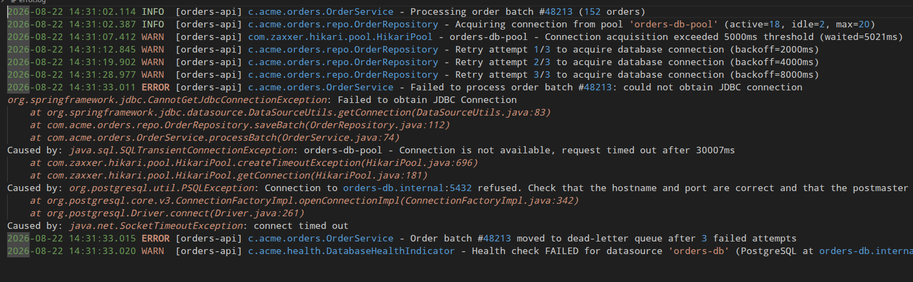
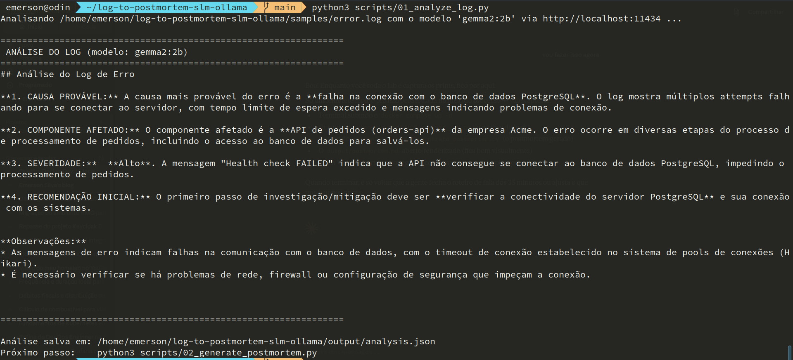
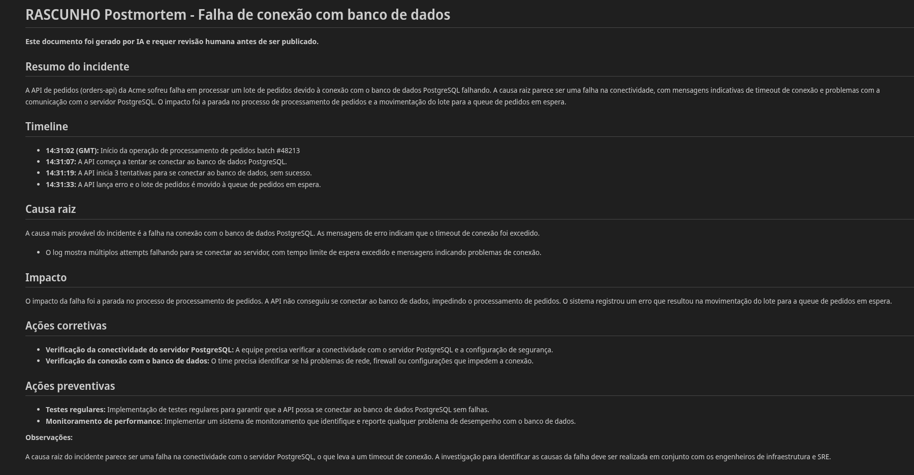
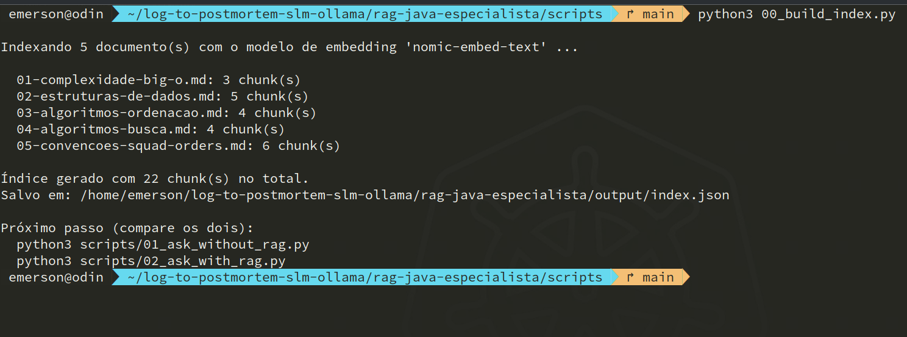
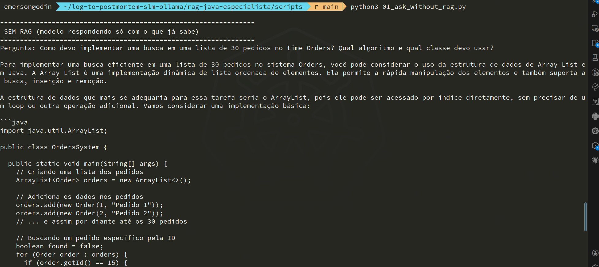
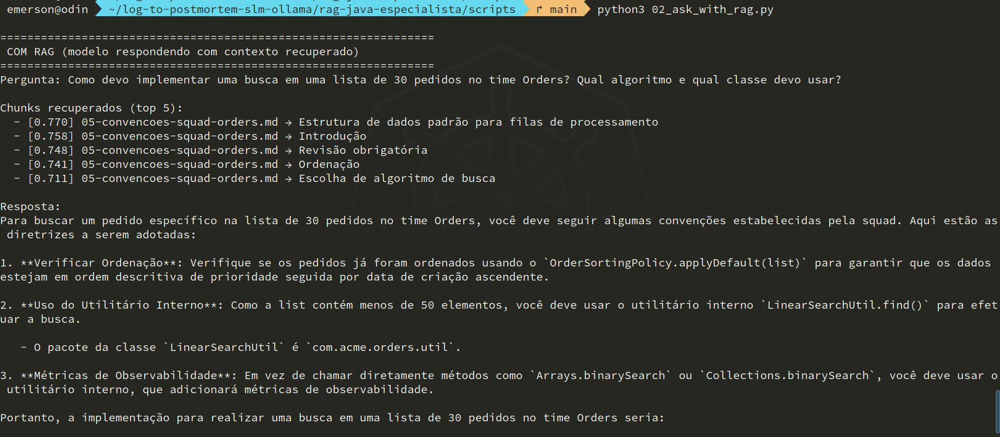

<!-- _paginate: false -->
<!-- _footer: "" -->
<style scoped>
section { display:flex; flex-direction:column; justify-content:center; align-items:center; height:100%; text-align:center; }
h1 { font-size: 2rem; font-weight: 800; background: linear-gradient(135deg, #00E6CC 0%, #4ECDC4 100%); -webkit-background-clip:text; -webkit-text-fill-color:transparent; background-clip:text; margin-bottom:0.6rem; line-height:1.25; }
h2 { font-size: 1.6rem; color:#F8FAFC; font-weight:400; opacity:0.9; }
h3 { font-size: 1.2rem; color: #4ECDC4; font-weight:500; margin-top:2rem; }
</style>

# O log não sai da rede.
## De erro a postmortem — e de SLM genérico a especialista — 100% local
### Emerson Silva

<div style="display:flex; justify-content:center; align-items:flex-end; gap:40px; margin-top:1.8rem;">
  
</div>

---
<!-- _paginate: false -->


# Emerson Silva

- Engenheiro DevOps/SRE na **4Linux**
- Autor de *Kubernetes para Iniciantes* e *Mentes Automatizadas: IA em Ambientes Kubernetes e DevOps*
- Community Lead de Kubernetes na **DougBrazil**
- Organizador do Chapter da **CNCF em Campinas**

---

## Agenda

1. O problema: postmortem custa tempo — e o log tem dado sensível
2. LLM vs. SLM — por que rodar localmente
3. Demo 1: de log de erro a rascunho de postmortem
4. Fine-tuning vs. RAG — como especializar um SLM sem treinar nada
5. Demo 2: o mesmo SLM virando especialista com contexto
6. O que aprendi testando de verdade — e quando isso serve pra você

---

<span class="tag neutral">O problema</span>

# 3h da manhã, o banco caiu

- O pager toca, você abre o log de erro — 20 linhas de stack trace
- Precisa virar isso em causa provável, severidade, e um rascunho de postmortem
- E se você colar esse log numa IA de nuvem: **hostname interno, IP, nome de cliente** — tudo isso agora é payload de uma API de terceiro

*A pergunta não é "IA ajuda aqui". É: dá pra ter essa ajuda sem o log sair da sua rede?*

---

<span class="tag accent">A resposta</span>

# SLM local, via Ollama

**SLM** (Small Language Model) — poucos bilhões de parâmetros, roda até em CPU, cabe no seu laptop. Não é um LLM (GPT, Claude, Gemini) menor por acaso: é feito pra ser pequeno.

- **Privacidade**: nada sai da sua rede — log, runbook, dado de cliente
- **Custo**: zero por token, sem cota de API
- **Disponibilidade**: funciona sem internet, no meio do incidente

Pra **tarefas estruturadas com contexto contido** — "analise este log", "gere este rascunho" — um SLM entrega resultado útil sem precisar de um LLM gigante.

---

<span class="tag neutral">A stack</span>

# Docker + Ollama, dois containers

```
┌──────────────┐        ┌──────────────┐
│    ollama    │◀──────▶│  open-webui  │
│  :11434 API  │        │    :3000     │
└──────────────┘        └──────────────┘
       ▲
       │ docker exec ollama ollama pull <modelo>
```

`docker compose up -d` sobe os dois. Modelo é baixado uma vez, fica em volume persistente. Scripts em **Python puro** — só `urllib` e `json` da standard library, nem `pip install`.

---

<span class="tag accent">Demo 1</span>

# De log de erro a postmortem

```
error.log ──▶ 01_analyze_log.py ──▶ analysis.json ──▶ 02_generate_postmortem.py ──▶ postmortem.md
                  (SLM via Ollama)                          (SLM via Ollama)
```

Log real e sintético: timeout de conexão com PostgreSQL, com retries e stack trace — o tipo de log que qualquer SRE já viu.

---

<span class="tag neutral">O incidente</span>

# O log que vamos analisar



<!-- print real: samples/error.log -->

---

<span class="tag accent">Demo 1</span>

# Passo 1 — análise estruturada



<!-- print real: python3 scripts/01_analyze_log.py -->

Causa provável, componente afetado, severidade, recomendação — em 4 seções, direto do prompt.

---

<span class="tag accent">Demo 1</span>

# Passo 2 — o rascunho de postmortem



<!-- print real: postmortem.md renderizado -->

**Sempre marcado como RASCUNHO.** É aceleração do trabalho do engenheiro — não substitui a revisão do time antes de publicar.

---

<span class="tag warn">Virando a chave</span>

# E se eu quiser um especialista?

Log genérico o SLM já ajuda. Mas e se eu quiser que ele conheça as **convenções do meu time** — nomes de classe internos, regras de nomenclatura, padrões que não estão em nenhum lugar público?

A resposta óbvia parece ser **fine-tuning**. Não é a primeira escolha.

---

<span class="tag neutral">Fine-tuning vs. RAG</span>

# Por que não fine-tuning (ainda)

- Fine-tuning ensina **estilo e formato** bem — não é confiável pra **injetar conhecimento novo**
- Exige dataset curado, pipeline de treino, avaliação — trabalho de ML de verdade
- **RAG** (Retrieval-Augmented Generation) resolve o mesmo problema sem treinar nada: busca o trecho certo de um documento real e entrega como contexto antes da resposta

*Fine-tuning fixa comportamento. RAG ancora em fatos. Pra conhecimento específico, RAG vence primeiro.*

---

<span class="tag accent">Demo 2</span>

# SLM genérico vs. SLM + RAG

Base de conhecimento local: docs gerais de algoritmos Java **+ um documento de convenções de uma squad fictícia** — coisas que nenhum modelo pré-treinado pode saber.

```
knowledge_base/*.md ──▶ 00_build_index.py ──▶ index.json (embeddings)
pergunta ──▶ 01_ask_without_rag.py  → resposta genérica
pergunta ──▶ 02_ask_with_rag.py     → busca no índice → resposta ancorada
```

---

<span class="tag accent">Demo 2</span>

# Construindo o índice vetorial



<!-- print real: 00_build_index.py — 5 docs, 22 chunks, embeddings via nomic-embed-text -->

---

<span class="tag warn">Sem RAG</span>

# A mesma pergunta, sem contexto



<!-- print real: 01_ask_without_rag.py -->

Plausível, "de livro-texto" — `ArrayList`, `indexOf`. Zero menção às convenções do time, porque isso não existe no pré-treinamento.

---

<span class="tag good">Com RAG</span>

# Agora com contexto recuperado



<!-- print real: 02_ask_with_rag.py — chunks recuperados + resposta correta -->

Cita `LinearSearchUtil.find()`, o pacote certo, e acerta o raciocínio sobre o limite de 50 elementos.

---

<span class="tag good">Testado de verdade</span>

# O bug que quase estragou a demo

O embedding de cada trecho só usava o texto da seção — não o título do documento. Resultado: um trecho certo (**"Escolha de algoritmo de busca"**) perdia posição no ranking porque só o título do doc mencionava "squad Orders".

**Corrigido** incluindo o título do documento no embedding de cada chunk. Chunking bem feito importa tanto quanto o modelo escolhido.

---

<span class="tag warn">O limite do RAG</span>

# RAG reduz alucinação. Não elimina.

Num dos testes, o modelo respondeu certo sobre `PriorityBlockingQueue` e `OrderSortingPolicy` — e começou a frase dizendo que o time Orders era **"da Alibaba Cloud"**. Detalhe inventado, fora de qualquer contexto fornecido.

*Mesma lição do rascunho de postmortem: revisão humana continua obrigatória — RAG ancora, não garante.*

---

## Quando usar / quando não usar

<div style="display:grid; grid-template-columns:1fr 1fr; gap:2.5rem; margin-top:0.5em;">
<div>

**Funciona bem**
- Tarefas estruturadas, contexto contido
- Ambientes com restrição de privacidade
- Primeira passada que economiza tempo do plantão

</div>
<div>

**Não substitui**
- Revisão humana em decisão crítica
- Contexto amplo que o modelo não tem
- Remediação automática sem humano no loop

</div>
</div>

**Regra prática: o SLM acelera. Não decide por você.**

---
<!-- _paginate: false -->
<!-- _footer: "" -->
<style scoped>
section { text-align: center; }
</style>

# Obrigado!

github.com/SEU_USUARIO/log-to-postmortem-slm-ollama

**Emerson Silva** · 4Linux
emerson-silva.blog.br · linkedin.com/in/silvemerson
